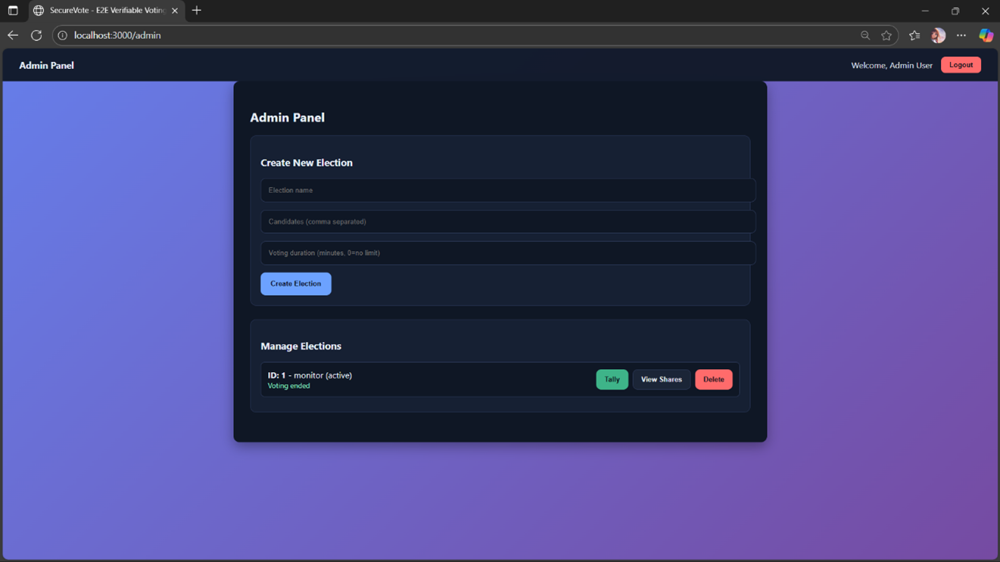
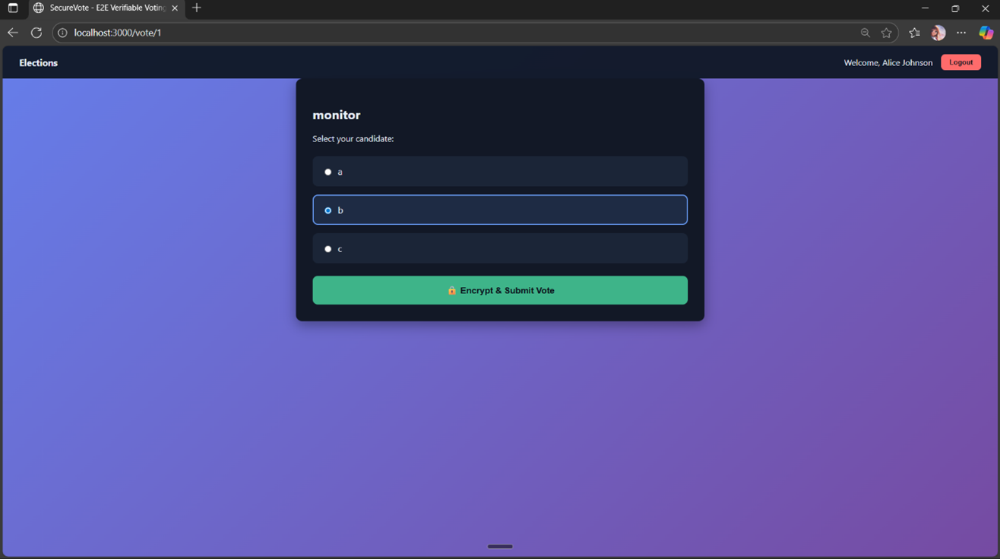
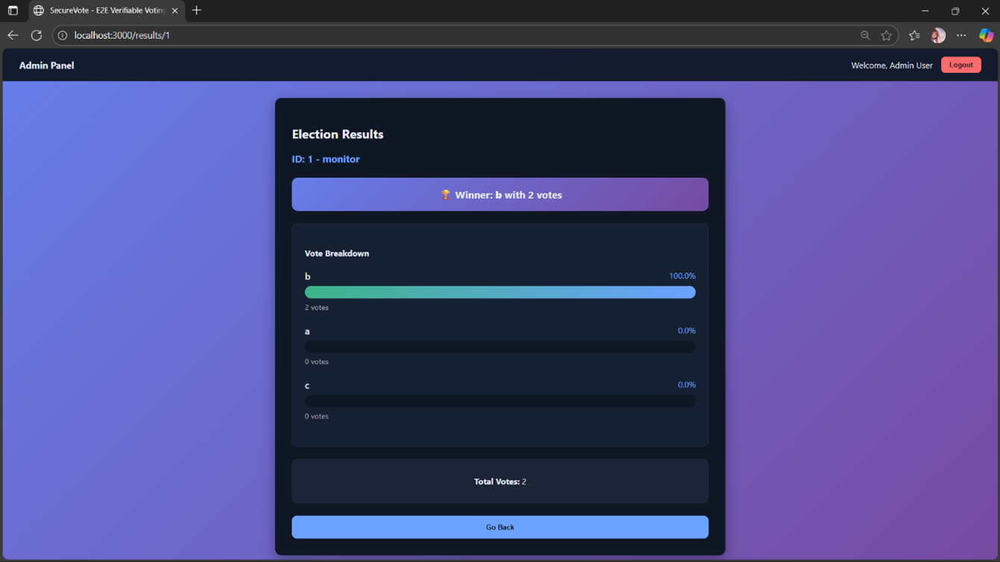

# SecureVote – Privacy Preserving Online Voting System

SecureVote is a secure web-based electronic voting system that ensures voter privacy, election transparency, and verifiable results using modern cryptographic techniques.

The system uses **Paillier Homomorphic Encryption** to keep votes encrypted while still allowing accurate vote counting. It also implements **threshold decryption**, where the private key is split among trustees so that no single authority can decrypt votes.

The platform includes OTP authentication, encrypted vote casting, duplicate vote prevention, and a public bulletin board for auditability, making it suitable for college elections, company voting, and community decision making.

---

# Features

- End-to-End encrypted voting
- Paillier Homomorphic Encryption for secure vote aggregation
- Threshold secret sharing for distributed trust
- OTP-based voter authentication
- Duplicate vote prevention
- Public bulletin board for transparency
- Admin dashboard for election management
- Secure automated vote tallying
- Simple and user-friendly interface

---

# Tech Stack

### Frontend
- React.js
- Axios
- Crypto-JS

### Backend
- Python
- Flask
- Flask-JWT-Extended

### Database
- SQLite

### Cryptography
- Paillier Homomorphic Encryption
- Shamir Secret Sharing

---

# System Workflow

1. Admin creates an election with candidates.
2. Voters authenticate using OTP.
3. Voters select a candidate and submit their vote.
4. Votes are encrypted on the client side before reaching the server.
5. Encrypted ballots are stored on a public bulletin board.
6. After voting ends, the admin tallies results using threshold decryption.
7. Final results are displayed without revealing individual votes.

---

# Screenshots

## Admin Panel


## Voting Interface


## Election Results


## Tie Result Example


---

# How to Run the Project

## 1. Clone the repository

```bash
git clone https://github.com/yourusername/securevote.git
cd securevote
```

## 2. Install backend dependencies

```bash
pip install -r requirements.txt
```

## 3. Run backend server

```bash
python app.py
```

## 4. Install frontend dependencies

```bash
cd frontend
npm install
```

## 5. Run frontend

```bash
npm start
```

Open the application in your browser:

```
http://localhost:3000
```

---

# Applications

- College elections
- Student council voting
- Company decision polls
- Community governance voting

---

# Future Improvements

- Blockchain-based vote storage
- Mobile application support
- Biometric authentication
- Large-scale election scalability
